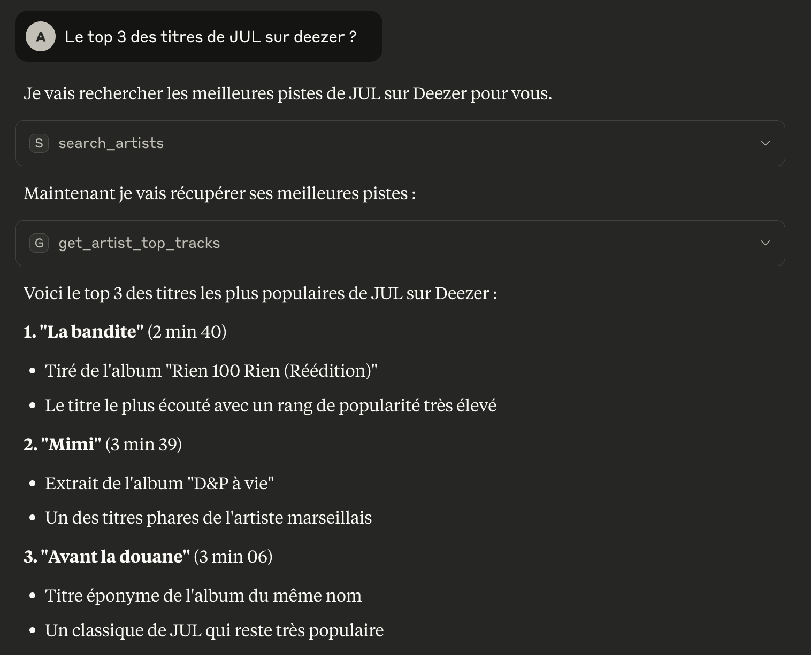

# Serveur MCP Deezer

Serveur Model Context Protocol (MCP) pour l'API Deezer permettant la recherche et l'exploration de contenu musical.



## Fonctionnalités

### 🔍 Recherche Musicale
- **Recherche basique** : Pistes, artistes, albums, playlists
- **Recherche avancée** : Critères combinés (artiste, durée, BPM, label, etc.)
- **Filtres** : Tri, limite, mode strict

### 📊 Détails de Contenu
- **Pistes** : Informations complètes, preview, métadonnées
- **Artistes** : Profil, albums, meilleures pistes
- **Albums** : Détails, tracklist, informations de release
- **Playlists** : Contenu, créateur, statistiques

### 🎵 Exploration
- **Genres** : Liste complète, artistes par genre
- **Découverte** : Recommandations basées sur les critères

## Installation

### Prérequis
- Python 3.11
- [uv](https://github.com/astral-sh/uv) - Gestionnaire de paquets Python rapide

### Installation en local

```bash
# Créer un environnement virtuel avec Python 3.11
uv venv --python 3.11

# Activer l'environnement virtuel
source .venv/bin/activate

# Installer les dépendances
uv pip install -r requirements.txt

# Démarrer le serveur
uv run deezer_mcp_server.py
```

Le serveur tourne par défaut avec le transport SSE (modifiable en bas du fichier deezer_mcp_server.py via la variable transport)

### Installation avec Docker

```bash
# Construire et démarrer le conteneur
docker compose up --build

# Pour exécuter en arrière-plan
docker compose up -d

# Pour arrêter le conteneur
docker compose down
```

Le serveur sera accessible sur http://localhost:8000

## Utilisation

### Démarrage du serveur
```bash
uv run deezer_mcp_server.py
```

### Exemples d'utilisation

#### Recherche simple
```python
# Recherche de pistes
await search_tracks({
    "query": "daft punk get lucky",
    "limit": 10,
    "order": "RANK_DESC"
})

# Recherche d'artistes
await search_artists("eminem", 20)
```

#### Recherche avancée
```python
# Recherche avec critères multiples
await advanced_search({
    "artist": "daft punk",
    "bpm_min": 120,
    "dur_min": 180,
    "limit": 25
})

# Recherche par durée et BPM
await advanced_search({
    "bpm_min": 140,
    "bpm_max": 160,
    "dur_max": 240
})
```

#### Exploration d'artistes
```python
# Détails d'un artiste
await get_artist_details(27)  # Daft Punk

# Albums d'un artiste
await get_artist_albums(27, limit=50)

# Meilleures pistes
await get_artist_top_tracks(27, limit=20)
```

### Outils Disponibles

| Outil | Description | Paramètres |
|-------|-------------|------------|
| search_tracks | Recherche de pistes | query, limit, strict, order |
| advanced_search | Recherche avec critères | artist, album, track, label, durée, BPM |
| get_track_details | Détails d'une piste | track_id |
| get_artist_details | Détails d'un artiste | artist_id |
| get_artist_albums | Albums d'un artiste | artist_id, limit |
| get_artist_top_tracks | Top pistes d'un artiste | artist_id, limit |
| get_album_details | Détails d'un album | album_id |
| get_playlist_details | Détails d'une playlist | playlist_id |
| search_artists | Recherche d'artistes | query, limit |
| search_albums | Recherche d'albums | query, limit |
| search_playlists | Recherche de playlists | query, limit |
| get_genre_list | Liste des genres | - |
| get_genre_artists | Artistes par genre | genre_id, limit |

## Ressources

- `deezer://api-endpoints` : Documentation des endpoints
- `deezer://search-examples` : Exemples de recherches
- `deezer-search-assistant` : Assistant de recherche musicale

## Critères de Recherche Avancée

| Critère | Description | Exemple |
|---------|-------------|---------|
| artist | Nom de l'artiste | artist:"daft punk" |
| album | Titre de l'album | album:"random access memories" |
| track | Titre de la piste | track:"get lucky" |
| label | Label de musique | label:"columbia" |
| dur_min/max | Durée en secondes | dur_min:180 dur_max:300 |
| bpm_min/max | Battements par minute | bpm_min:120 bpm_max:140 |

## Gestion des Erreurs

Le serveur gère automatiquement :

- **Erreurs réseau** : Reconnexion automatique
- **Erreurs API** : Messages d'erreur détaillés
- **Validation** : Paramètres validés avec Pydantic
- **Rate limiting** : Respect des limites de l'API

## Limites

- **API publique uniquement** : Pas d'authentification utilisateur
- **Lecture seule** : Pas de modification de playlists/favoris
- **Rate limiting** : Respecter les limites de Deezer
- **Géolocalisation** : Certains contenus peuvent être indisponibles selon la région

### Configuration pour Claude Desktop

Ajouter à `claude_desktop_config.json` :

Avec le transport SSE :

```json
{
  "mcpServers": {
    "deezer": {
      "command": "npx",
      "args": [
        "mcp-remote",
        "http://localhost:8000/sse",
        "--transport",
        "sse-only"
      ]
    }
  }
}
```

Ce serveur MCP Deezer est maintenant prêt à être utilisé ! Il offre une interface complète pour explorer et rechercher dans le catalogue musical de Deezer via le protocole MCP.